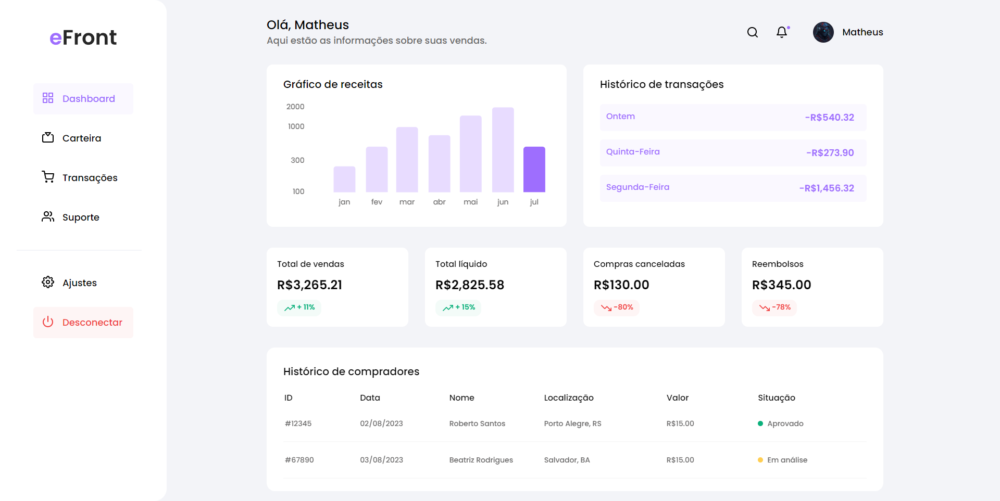
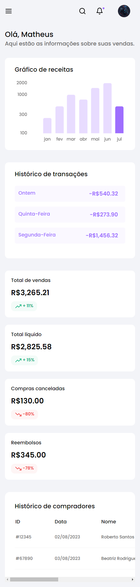

<h1>Desafio Codelândia #40</h1>

Esse projeto faz parte de um desafio do servidor <a>Codelândia</a>, nele consegui ter o primeiro contato com o TailwindCSS, além disso testei minhas habilidades com diversas tecnologias como Angular, Typescript, ChartJS, Feather.

Com esse projeto, pude exercitar diversos componentes do design Web, como responsividade, tabelas, gráficos, grids, e o mobile first.
 
 
<a href="">Clique aqui para ver o deploy</a>
 

Fotos do projeto
 

